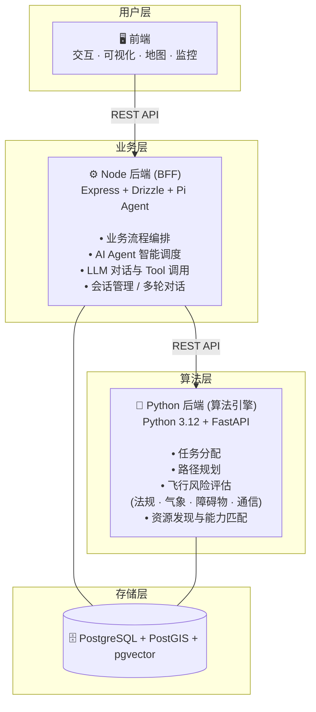
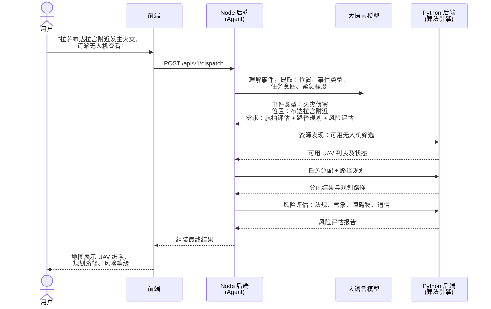

# ST-Risk-For-UAV

**基于大语言模型 AI Agent 的无人机智能调度系统**

## 项目简介

ST-Risk-For-UAV 是一套面向异构无人机集群的智能调度与风险评估平台。系统以大语言模型（LLM）驱动的 AI Agent 为核心，实现从无人机资源管理、任务适配、多机多任务分配、路径规划到飞行风险评估的完整调度闭环。

### 核心能力

| 能力域 | 说明 |
|--------|------|
| **异构无人机资源管理** | 多类型 UAV 的注册、发现、状态监控与能力画像 |
| **任务适配** | 根据任务需求（载荷、时效、优先级）自动匹配合适的 UAV 资源 |
| **多机多任务分配** | 多架无人机对多个任务的目标分配 |
| **路径规划** | 单机路径规划与多机协同路径规划 |
| **飞行风险评估** | 任务分配与飞行路线的风险评估，涵盖法律法规、气象条件、地面障碍物、通信状况等 |
| **AI Agent 智能调度** | LLM Agent 理解自然语言指令，自主编排调度流程 |

## 系统架构

### 整体架构



> **前端只与 Node 后端通信，Node 作为唯一网关代理对 Python 的调用。** 前端不直接访问 Python 端，保持单一出口、统一鉴权和简洁的前端逻辑。

### 调用流程示例



### 职责划分

| 层级 | 职责 | 技术栈 | 对外接口 |
|------|------|--------|----------|
| **前端** | 用户交互、地图可视化、任务监控、调度结果展示 | TypeScript · pnpm | — |
| **Node 后端** | 业务流程编排、AI Agent 开发、LLM 对话与 Tool 调用、REST API 聚合 | Express · Drizzle · pi-ai / pi-agent-core | 面向前端 · REST API |
| **Python 后端** | 任务分配、路径规划、飞行风险评估（法规/气象/障碍物/通信）、资源发现 | Python 3.12 · FastAPI · uv | 面向 Node · REST API |
| **共享层** | 类型定义、API 封包、领域模型、工具函数 | TypeScript / Python | — |
| **数据库** | 任务记录、UAV 状态、调度历史、空间数据、向量索引 | PostgreSQL + PostGIS + pgvector | — |

> **PostgreSQL 扩展：** PostGIS 用于空间查询（UAV 位置、禁飞区、路径地理围栏）；pgvector 用于向量检索（任务语义匹配、场景相似度）。

> **Python 端不直接面向前端，专注于算法能力；Node 端作为 BFF 网关，统一处理鉴权、编排和 Agent 逻辑。**

## 项目结构

```
ST-Risk-For-UAV/
├── apps/
│   ├── client/
│   │   └── web-frontend/                  # 前端应用 (TypeScript)
│   └── server/
│       ├── python-fastapi-backend/        # Python 后端 — 算法引擎
│       │   ├── src/
│       │   │   ├── main.py                # FastAPI 入口
│       │   │   ├── task_allocation/       # 任务分配领域
│       │   │   │   ├── router.py          #   API 路由
│       │   │   │   ├── schemas.py         #   请求/响应模型
│       │   │   │   ├── service.py         #   业务编排
│       │   │   │   └── algorithms/        #   核心算法（待选型）
│       │   │   ├── path_planning/         # 路径规划领域
│       │   │   │   ├── router.py
│       │   │   │   ├── schemas.py
│       │   │   │   ├── service.py
│       │   │   │   └── algorithms/        #   核心算法（待选型）
│       │   │   └── shared/                # 跨领域共享
│       │   │       ├── models.py          #   UAV, Task, Position 等领域模型
│       │   │       └── utils.py           #   几何计算工具
│       │   ├── tests/                     # 测试
│       │   └── pyproject.toml             # Python 依赖配置
│       └── node-backend/                  # Node 后端 — 业务 & Agent
├── packages/
│   ├── shared-ts/                         # 共享 TypeScript 代码
│   │   └── src/
│   │       ├── types/                     #   类型定义
│   │       ├── api/                       #   API 请求封装
│   │       └── utils/                     #   工具函数
│   └── shared-py/                         # 共享 Python 代码
│       └── src/
│           └── shared_py/
├── scripts/                               # 自动化脚本
├── docs/                                  # 项目文档
│   ├── CONTRIBUTING.md                    #   协作指南
│   ├── 前端技术选型建议.md                  #   前端选型分析
│   └── 后端技术选型建议.md                  #   后端选型分析
├── package.json                           # pnpm 根配置
├── pnpm-workspace.yaml                    # pnpm 工作区定义
├── pyproject.toml                         # uv / Python 根配置
├── tsconfig.base.json                     # TypeScript 基础配置
└── uv.lock                                # uv 锁文件
```

## Python 后端 API

算法引擎对 Node 后端暴露 REST API，由 Node 端代理调用（具体算法待定，以下为接口占位）：

| 方法 | 路径 | 说明 |
|------|------|------|
| POST | `/api/v1/tasks/allocate` | 提交任务分配请求 |
| GET | `/api/v1/tasks/algorithms` | 列出可用分配算法 |
| POST | `/api/v1/paths/plan` | 提交路径规划请求 |
| GET | `/api/v1/paths/algorithms` | 列出可用规划算法 |
| POST | `/api/v1/resources/discover` | 资源发现：可用 UAV 筛选 |
| GET | `/health` | 健康检查 |

### 领域模型

```python
# 无人机
UAV: id, position, speed, max_payload, battery, status

# 任务
Task: id, position, priority, payload_weight, time_limit

# 任务分配结果
TaskAllocation: uav_id, task_id, estimated_cost

# 路径规划结果
PathPlan: uav_id, task_id, waypoints[], total_distance, estimated_time
```

## 快速开始

### 环境要求

- **Node.js** ≥ 18
- **pnpm** ≥ 10
- **Python** ≥ 3.12
- **uv** ≥ 0.4

### 安装依赖

```bash
# Node 依赖（根目录，包含所有 workspace 包）
pnpm install

# Python 依赖
cd apps/server/python-fastapi-backend
uv sync --extra dev
```

### 运行

```bash
# Python 后端（算法引擎 · FastAPI）
cd apps/server/python-fastapi-backend
uv run uvicorn src.main:app --reload --host 0.0.0.0 --port 8000

# Node 后端（业务 & Agent）
pnpm --filter node-backend dev

# 前端（开发模式）
pnpm --filter web-frontend dev
```

### 测试

```bash
# Python 后端测试
cd apps/server/python-fastapi-backend
uv run pytest tests/ -v
```

## 开发指南

### 添加前端 / Node 依赖

```bash
pnpm --filter <package-name> add <dependency>
```

### 添加 Python 依赖

```bash
cd apps/server/python-fastapi-backend
uv add <package>

# 开发依赖
uv add --extra dev <package>
```

### 工作区结构

- **pnpm workspace** 管理所有 TypeScript/Node 包（前端 + Node 后端 + shared-ts）
- **uv** 管理所有 Python 包（Python 后端 + shared-py）
- TypeScript 包之间通过 `workspace:*` 协议互引
- Python 子包通过 uv 虚拟环境统一管理

## 协作流程

小团队轻量协作，详见 [docs/CONTRIBUTING.md](docs/CONTRIBUTING.md)

## 文档

- [协作指南](docs/CONTRIBUTING.md) — 分支策略、代码规范、PR 流程
- [前端技术选型建议](docs/前端技术选型建议.md) — UI 组件库、地图/3D 库选型
- [后端技术选型建议](docs/后端技术选型建议.md) — Node/Python 后端框架、Agent 底座
- [文档目录](docs/) — 全部设计文档与架构决策
