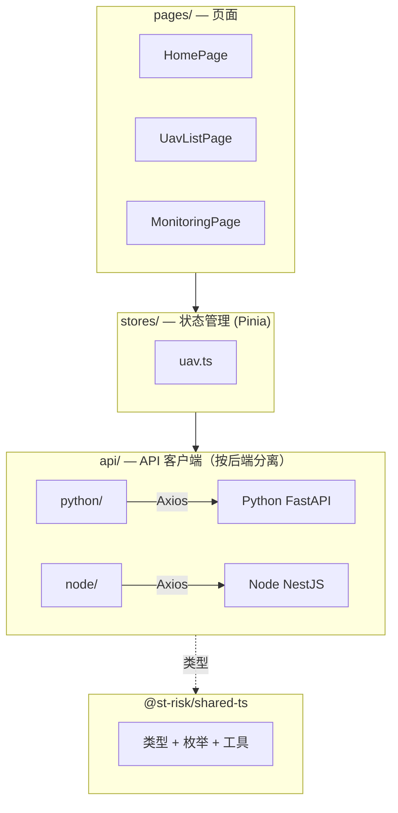
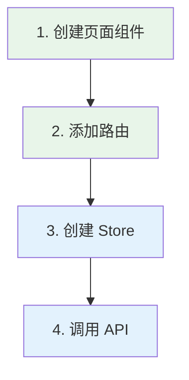

# ST-Risk UAV Service — Web Frontend

无人机任务分配与风险评估系统前端，基于 Vue 3 + TypeScript 构建。

## 技术栈

- **框架**：Vue 3（Composition API）
- **语言**：TypeScript
- **构建工具**：Vite
- **状态管理**：Pinia
- **路由**：Vue Router 4
- **HTTP 客户端**：Axios
- **包管理**：pnpm（monorepo workspace）

## 快速开始

```bash
# 安装依赖（monorepo 根目录执行）
pnpm install

# 启动开发服务
pnpm --filter @st-risk/web-frontend dev

# 构建
pnpm --filter @st-risk/web-frontend build

# 预览构建产物
pnpm --filter @st-risk/web-frontend preview
```

开发服务默认运行在 http://localhost:5173。

## 架构

### 双后端调用

前端同时与两个后端通信，通过 Vite 代理和独立 API 客户端分离：

```mermaid
graph LR
    FE[前端 :5173] -->|/api/v1/*| NODE[Node :3000]
    FE -->|/api/python/*| PY[Python :8000]

    subgraph "Vite 开发代理"
        P1["/api/v1 → localhost:3000"]
        P2["/api/python → localhost:8000"]
    end

    FE -.-> SHARED[@st-risk/shared-ts]
    NODE -.-> SHARED
    PY -.->|对应| SHARED
```

| 路径前缀 | 目标 | 用途 |
|----------|------|------|
| `/api/v1/*` | Node NestJS :3000 | Agent 业务逻辑、资源管理 |
| `/api/python/*` | Python FastAPI :8000 | 算法计算（路径规划、任务分配、风险评估） |

### 分层总览



### 目录结构

```
src/
├── main.ts                  # 应用入口
├── App.vue                  # 根组件
│
├── api/                     # API 客户端（按后端分离）
│   ├── http.ts              #   Axios 实例工厂
│   ├── python/              #   → Python FastAPI（算法）
│   │   └── index.ts
│   └── node/                #   → Node NestJS（Agent）
│       └── index.ts
│
├── router/                  # 路由
│   └── index.ts
│
├── stores/                  # Pinia 状态管理
│   └── uav.ts
│
├── pages/                   # 页面组件
│   ├── HomePage.vue
│   ├── UavListPage.vue
│   ├── MonitoringPage.vue
│   └── PlanningPage.vue
│
├── layouts/                 # 布局组件
│   └── MainLayout.vue
│
├── components/              # 通用组件
│   ├── common/
│   └── uav/
│
├── composables/             # 组合式函数
│
├── domain/                  # 前端领域逻辑（可选）
│
├── utils/                   # 工具函数
│
└── assets/                  # 静态资源
    └── styles/
```

### 各层职责

| 层 | 目录 | 职责 |
|---|------|------|
| 页面 | `pages/` | 路由对应的页面组件 |
| 布局 | `layouts/` | 页面布局骨架（侧边栏、顶栏等） |
| 组件 | `components/` | 可复用 UI 组件 |
| 状态 | `stores/` | Pinia store，管理全局状态 |
| API | `api/` | HTTP 客户端，按后端分离 |
| 路由 | `router/` | Vue Router 路由配置 |
| 组合式函数 | `composables/` | 可复用的组合式逻辑 |
| 工具 | `utils/` | 通用工具函数 |
| 资源 | `assets/` | 图片、样式等静态资源 |

## API 分离

两个后端的调用完全分离，通过统一入口导出：

```typescript
// api/index.ts
export { pythonApi } from './python';  // 算法计算
export { nodeApi } from './node';      // 业务逻辑
```

使用时按需引入：

```typescript
import { pythonApi, nodeApi } from '@/api';

// 调用 Python 端做路径规划
const plan = await pythonApi.planPath({ uavId, taskId, start, goal });

// 调用 Node 端执行 Agent 任务
const result = await nodeApi.executeAgentTask({ uavId, taskId, instruction });
```

## 共享类型

通过 `@st-risk/shared-ts` 包与 Node 后端共享类型：

```typescript
import type { UAV, Task, UAVStatus } from '@st-risk/shared-ts';
```

## 开发新页面

### 流程



### Step 1 — 创建页面组件

```vue
<!-- src/pages/UavDetailPage.vue -->
<template>
  <div>
    <h2>无人机详情 {{ uavId }}</h2>
  </div>
</template>

<script setup lang="ts">
import { useRoute } from 'vue-router';
const route = useRoute();
const uavId = route.params.id as string;
</script>
```

### Step 2 — 添加路由

```typescript
// src/router/index.ts
{
  path: 'uavs/:id',
  name: 'uav-detail',
  component: () => import('@/pages/UavDetailPage.vue'),
}
```

### Step 3 — 创建 Store（如需）

```typescript
// src/stores/uav-detail.ts
export const useUavDetailStore = defineStore('uav-detail', () => {
  const uav = ref<UAV | null>(null);

  async function fetchUav(id: string) {
    uav.value = await nodeApi.getUav(id);
  }

  return { uav, fetchUav };
});
```

### Step 4 — 调用 API

```typescript
import { nodeApi, pythonApi } from '@/api';

// Node 端：获取 UAV 数据
const uav = await nodeApi.getUav(id);

// Python 端：做风险评估
const risk = await pythonApi.assessRisk({ uav, task, obstacles });
```

## 环境变量

| 变量 | 默认值 | 说明 |
|------|--------|------|
| `VITE_NODE_API_URL` | `/api/v1` | Node 后端代理路径 |
| `VITE_PYTHON_API_URL` | `/api/python` | Python 后端代理路径 |

## 依赖

### 运行时

- vue ^3.5
- vue-router ^4.5
- pinia ^3.0
- axios ^1.7
- @st-risk/shared-ts（workspace 内部包）

### 开发

- vite ^6.0
- @vitejs/plugin-vue
- vue-tsc
- typescript ^5.7
- vitest
