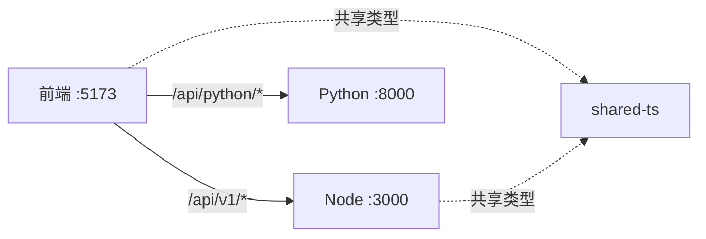
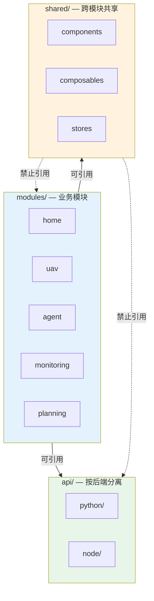
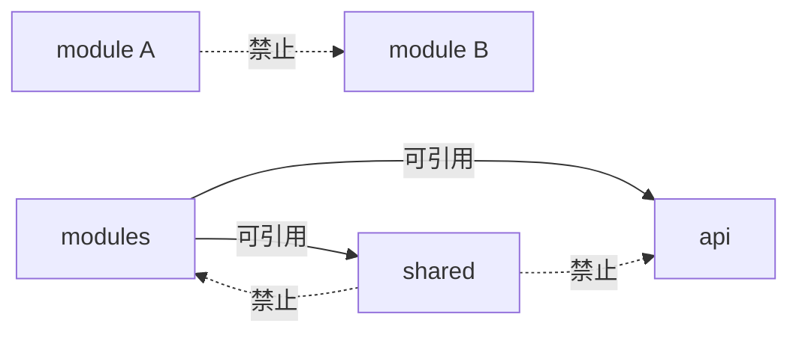
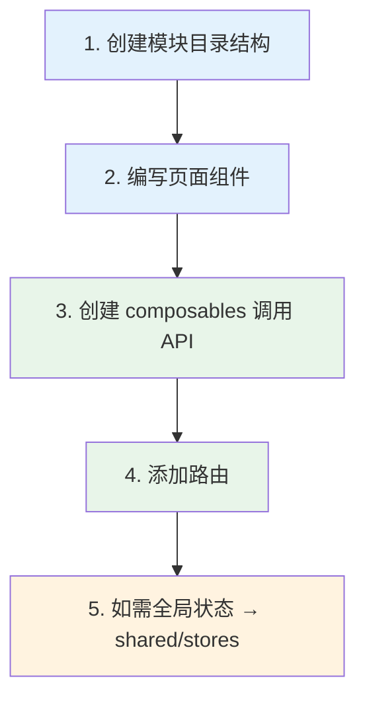

# ST-Risk UAV Service — Web Frontend

无人机任务分配与风险评估系统前端，基于 Vue 3 + TypeScript 构建。

## 技术栈

- **框架**：Vue 3（Composition API）
- **语言**：TypeScript
- **构建工具**：Vite
- **状态管理**：Pinia
- **路由**：Vue Router 4
- **HTTP 客户端**：Axios
- **包管理**：pnpm（monorepo workspace）

## 快速开始

```bash
# 安装依赖（monorepo 根目录执行）
pnpm install

# 启动开发服务
pnpm run dev:web

# 构建
pnpm run build:web

# Lint
pnpm run lint:web

# 单元测试
pnpm run test:web

# 类型检查
pnpm run typecheck

# 清理产物
pnpm run clean:web
```

开发服务默认运行在 http://localhost:5173。

## 架构

### 双后端调用



| 路径前缀 | 目标 | 说明 |
|----------|------|------|
| `/api/v1/*` | Node NestJS :3000 | Agent 业务逻辑、资源管理 |
| `/api/python/*` | Python FastAPI :8000 | 算法计算（Vite 重写为 `/api/v1`） |

### 模块化结构



### 目录结构

```
src/
├── main.ts                    # 应用入口
├── App.vue                    # 根组件
│
├── modules/                   # 业务模块（内聚）
│   ├── home/                  #   首页
│   │   ├── pages/HomePage.vue
│   │   └── index.ts
│   ├── uav/                   #   ① 无人机资源管理
│   │   ├── pages/UavListPage.vue
│   │   └── index.ts
│   ├── agent/                 #   Agent 任务编排
│   │   ├── pages/AgentPage.vue
│   │   └── index.ts
│   ├── monitoring/            #   飞行监控
│   │   ├── pages/MonitoringPage.vue
│   │   └── index.ts
│   └── planning/              #   航线规划
│       ├── pages/PlanningPage.vue
│       └── index.ts
│
├── shared/                    # 跨模块共享
│   ├── components/
│   │   └── MainLayout.vue
│   ├── composables/index.ts
│   ├── stores/
│   │   ├── uav.ts
│   │   └── index.ts
│   └── index.ts
│
├── api/                       # API 客户端（按后端分离）
│   ├── http.ts                #   Axios 实例工厂
│   ├── python/index.ts        #   → Python FastAPI
│   ├── node/index.ts          #   → Node NestJS
│   └── index.ts               #   统一导出
│
└── router/
    └── index.ts
```

### 路由表

| 路径 | 页面组件 | 布局 |
|------|----------|------|
| `/` | `HomePage` | MainLayout |
| `/uavs` | `UavListPage` | — |
| `/agent` | `AgentPage` | — |
| `/monitoring` | `MonitoringPage` | — |
| `/planning` | `PlanningPage` | — |

### API 方法

#### nodeApi（→ Node NestJS）

| 方法 | 说明 |
|------|------|
| `executeAgentTask` | 执行 Agent 任务 |
| `createUav` | 创建无人机 |
| `listUavs` | 获取无人机列表 |
| `getUav` | 获取单个无人机详情 |
| `health` | 健康检查 |

#### pythonApi（→ Python FastAPI）

| 方法 | 说明 |
|------|------|
| `planPath` | 航线规划 |
| `allocateTasks` | 任务分配 |
| `assessRisk` | 风险评估 |
| `evaluateAdaptability` | 适应性评估 |
| `listPathAlgorithms` | 获取可用路径算法列表 |
| `listAllocationAlgorithms` | 获取可用分配算法列表 |

### Vite 代理配置

```typescript
// vite.config.ts
server: {
  proxy: {
    '/api/v1': {
      target: 'http://localhost:3000',   // Node NestJS
      changeOrigin: true,
    },
    '/api/python': {
      target: 'http://localhost:8000',   // Python FastAPI
      changeOrigin: true,
      rewrite: (path) => path.replace(/^\/api\/python/, '/api/v1'),
    },
  },
}
```

### 各层职责

| 层 | 目录 | 职责 |
|---|------|------|
| 业务模块 | `modules/` | 功能内聚：pages + index.ts |
| 共享层 | `shared/` | 跨模块共享：组件、composables、全局 stores |
| API 层 | `api/` | HTTP 客户端，按后端分离 |
| 路由 | `router/` | Vue Router 配置 |

## 依赖方向规则



| 规则 | 说明 |
|------|------|
| modules → api | ✅ 通过 composables 调用 api 封装函数 |
| modules → shared | ✅ 引用共享组件、composables、全局 stores |
| modules → modules | ❌ 禁止互相引用 |
| shared → modules | ❌ 保持纯净 |
| shared → api | ❌ 保持纯净 |
| 直接使用 Axios | ❌ 必须通过 api 层封装函数 |

## API 分离

```typescript
// api/index.ts — 统一导出
export { pythonApi } from './python';  // 算法
export { nodeApi } from './node';      // Agent
```

模块内通过 composables 调用：

```typescript
// modules/uav/composables/useUav.ts
import { nodeApi } from '@/api';

export function useUav() {
  async function fetchUavs() {
    return nodeApi.listUavs();
  }
  return { fetchUavs };
}
```

## 共享类型

通过 `@st-risk/shared-ts` 与 Node 后端共享：

```typescript
import type { UAV, UAVStatus } from '@st-risk/shared-ts';
```

## 开发新模块

### 流程



### Step 1 — 创建模块目录

```
src/modules/new-feature/
├── pages/              # 页面组件
└── index.ts            # 统一导出
```

### Step 2 — 编写页面组件

```vue
<!-- modules/new-feature/pages/ListPage.vue -->
<template>
  <div>...</div>
</template>
```

### Step 3 — 创建 composables 调用 API

```typescript
// modules/new-feature/composables/useFeature.ts
import { nodeApi } from '@/api';  // ✅ 通过 api 层

export function useFeature() {
  async function fetchData() {
    return nodeApi.someMethod();
  }
  return { fetchData };
}
```

> ⚠️ 严禁直接使用 Axios，必须通过 `@/api` 封装函数。

### Step 4 — 添加路由

```typescript
// router/index.ts
{ path: 'new-feature', component: () => import('@/modules/new-feature/pages/ListPage.vue') }
```

### Step 5 — 如需全局状态 → shared/stores

仅当状态需跨模块共享时，放入 `shared/stores/`。模块内部状态直接在模块目录内管理。

模块 index.ts 统一导出：

```typescript
// modules/new-feature/index.ts
export { default as ListPage } from './pages/ListPage.vue';
```

## 环境变量

| 变量 | 默认值 | 说明 |
|------|--------|------|
| `VITE_NODE_API_URL` | `/api/v1` | Node 后端代理路径 |
| `VITE_PYTHON_API_URL` | `/api/python` | Python 后端代理路径 |

## 依赖

### 运行时

- vue ^3.5
- vue-router ^4.5
- pinia ^3.0
- axios ^1.7
- @st-risk/shared-ts（workspace 内部包）

### 开发

- vite ^6.0
- @vitejs/plugin-vue
- vue-tsc, typescript ^5.7
- vitest
