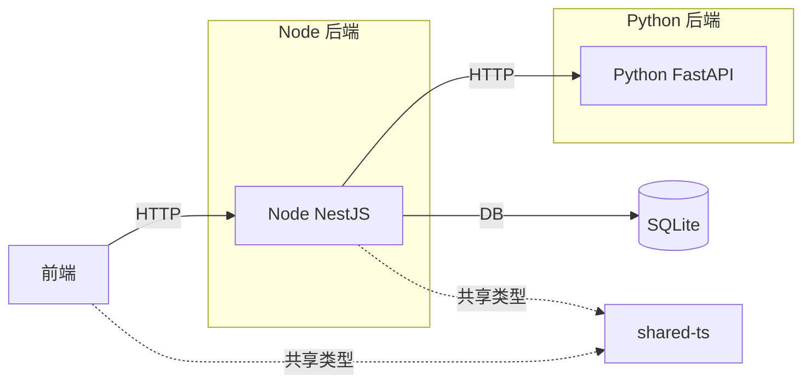
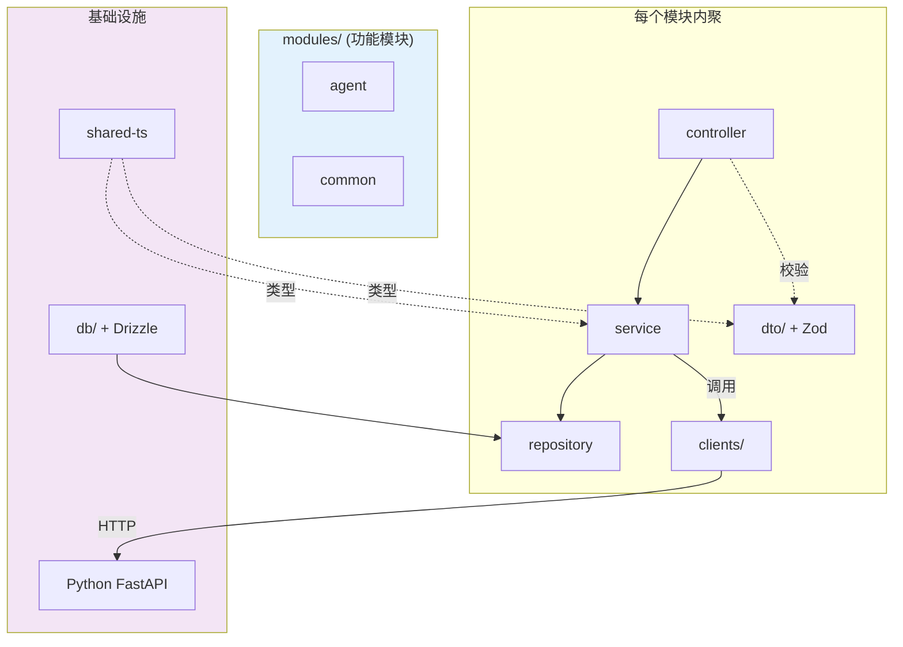
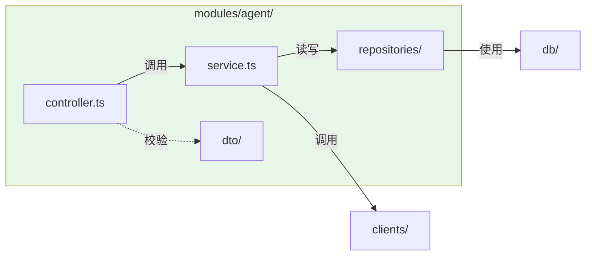
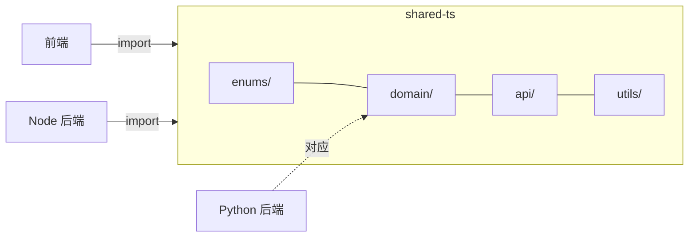

# ST-Risk UAV Service — Node.js NestJS Backend

Agent 服务，基于 NestJS 构建，负责编排业务流程并调用 Python 后端完成算法计算。

## 技术栈

- **语言**：TypeScript ≥ 5.7
- **框架**：NestJS 11
- **包管理**：pnpm（monorepo workspace）
- **数据校验**：Zod
- **数据库**：Drizzle ORM + SQLite
- **测试**：Jest

## 快速开始

```bash
# 安装依赖（monorepo 根目录执行）
pnpm install

# 启动开发服务
pnpm --filter @st-risk/node-backend dev

# 构建
pnpm --filter @st-risk/node-backend build

# 运行测试
pnpm --filter @st-risk/node-backend test
```

服务默认运行在 http://localhost:3000，API 前缀 `/api/v1`。

## 架构

### 与 Python 后端的关系



- **Node 端**：Agent 编排、业务流程、数据持久化
- **Python 端**：算法计算（路径规划、任务分配、风险评估）
- **shared-ts**：前后端共享的类型定义和工具函数

### 分层总览



### 目录结构

```
src/
├── main.ts                          # NestJS 启动入口
│
├── app/                             # 应用层
│   └── app.module.ts                #   根模块
│
├── shared/                          # 横切关注点
│   └── pipes/
│       └── zod.pipe.ts              #   Zod 校验管道
│
├── clients/                         # 外部服务客户端
│   └── python-backend/
│       └── client.ts                #   调用 Python FastAPI
│
├── db/                              # 数据库层（Drizzle ORM）
│   ├── engine.ts                    #   数据库实例
│   └── models/                      #   ORM 模型
│       ├── uav.ts
│       └── task.ts
│
└── modules/                         # 功能模块（内聚）
    ├── common/                      #   公共模块
    │   ├── common.module.ts
    │   └── common.controller.ts     #     GET /health
    └── agent/                       #   Agent 模块
        ├── agent.module.ts
        ├── agent.controller.ts      #     POST /agent/execute
        ├── agent.service.ts         #     编排逻辑
        ├── dto/                     #     Zod 校验
        │   └── agent-task.dto.ts
        └── repositories/            #     数据访问
            └── agent.repo.ts
```

### 各层职责

| 层 | 目录 | 职责 |
|---|------|------|
| 模块 | `modules/` | 功能内聚：controller + service + repository + dto |
| 共享 | `shared/` | 横切关注点：pipes、guards、interceptors、filters |
| 客户端 | `clients/` | 调用外部服务（Python 后端） |
| 数据库 | `db/` | Drizzle ORM 引擎 + 模型 |
| 共享包 | `packages/shared-ts` | 前后端共享类型、枚举、工具 |

### 模块内聚原则

每个功能模块内部包含完整的请求处理链：



- `controller.ts` — 路由 + HTTP 处理
- `service.ts` — 业务编排
- `dto/` — Zod 请求校验
- `repositories/` — 数据访问

新增功能模块时，只需在 `modules/` 下创建新目录，包含上述四个文件即可。

## 共享类型

通过 `@st-risk/shared-ts` 包实现前后端类型共享：

```typescript
// 前端和 Node 后端使用同一套类型
import { UAV, UAVStatus, AllocateRequest } from '@st-risk/shared-ts';
```



## 环境变量

| 变量 | 默认值 | 说明 |
|------|--------|------|
| `PORT` | `3000` | 服务端口 |
| `PYTHON_BACKEND_URL` | `http://localhost:8000` | Python 后端地址 |
| `UAV_DATABASE_URL` | `./data/uav.db` | SQLite 数据库路径 |

## 依赖

### 运行时

- @nestjs/common, @nestjs/core, @nestjs/platform-express
- @st-risk/shared-ts（workspace 内部包）
- drizzle-orm + better-sqlite3
- zod
- rxjs, reflect-metadata

### 开发

- @nestjs/cli, @nestjs/testing
- drizzle-kit
- jest, ts-jest
- typescript
