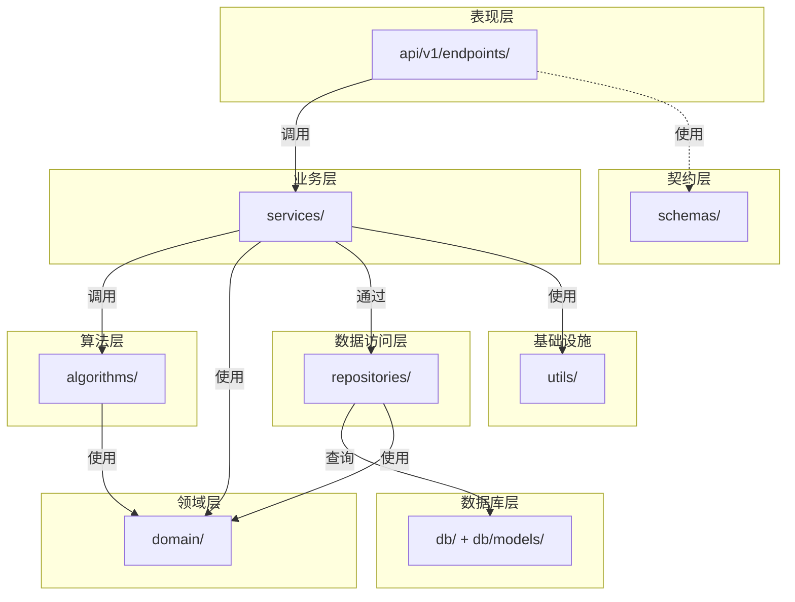
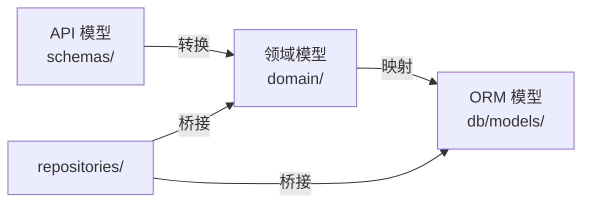
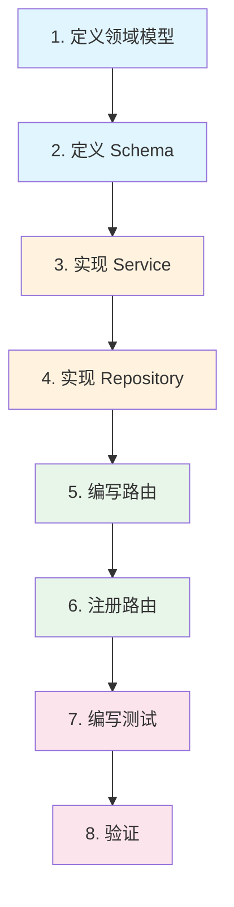
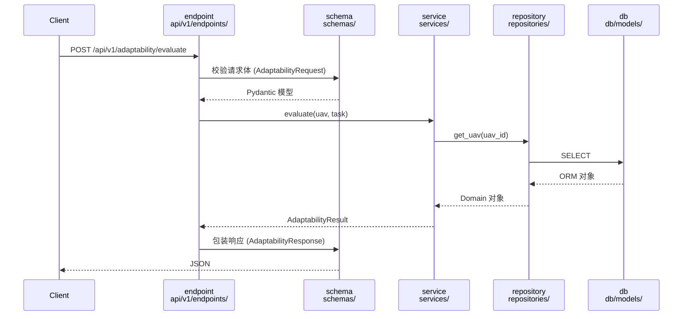
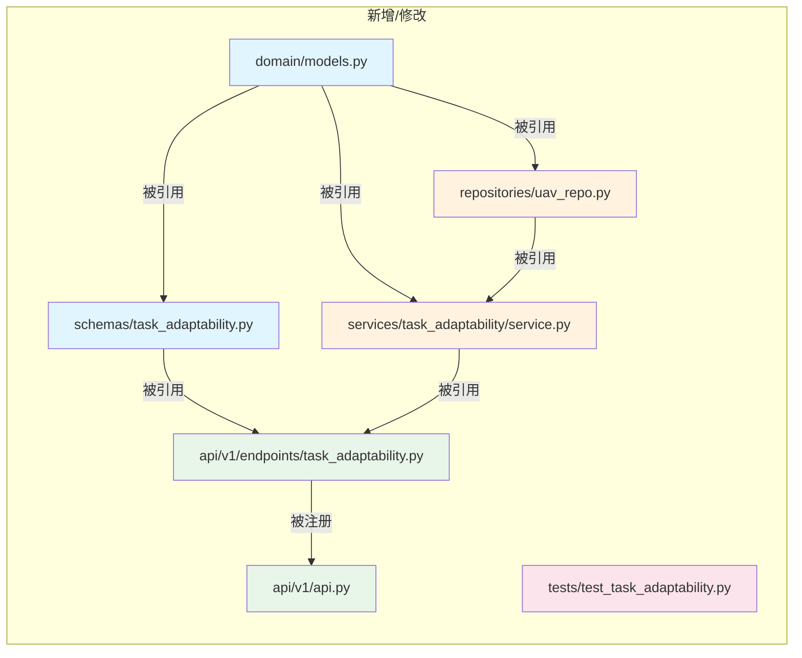

# ST-Risk UAV Service — Python FastAPI Backend

无人机任务分配与路径规划服务，基于 FastAPI 构建，采用分层架构。

## 技术栈

- **语言**：Python ≥ 3.12
- **Web 框架**：FastAPI + Uvicorn
- **包管理**：uv
- **数据校验**：Pydantic ≥ 2.0
- **数据库**：SQLAlchemy 2.0（异步）+ Alembic 迁移
- **测试**：pytest + httpx

## 快速开始

```bash
# 安装 uv（如未安装）
curl -LsSf https://astral.sh/uv/install.sh | sh

# 安装依赖
uv sync

# 安装开发依赖
uv sync --extra dev

# 数据库迁移
alembic upgrade head

# 启动服务
uv run uvicorn src.main:app --reload --host 0.0.0.0 --port 8000

# 运行测试
uv run pytest tests/ -v
```

服务启动后访问 http://localhost:8000/docs 查看 Swagger 文档。

## 架构

### 分层总览



### 目录结构

```
src/
├── main.py                          # 入口
│
├── api/                             # 表现层
│   └── v1/
│       ├── api.py                   #   路由汇总注册
│       └── endpoints/               #   路由处理器
│
├── schemas/                         # API 契约层（Request / Response）
│
├── services/                        # 业务层（每个模块一个包）
│   ├── uav_resource/
│   ├── task_adaptability/
│   ├── risk_assessment/
│   ├── task_allocation/
│   ├── route_planning/
│   └── flight_monitoring/
│
├── domain/                          # 领域层（Pydantic 实体、枚举、异常）
│   ├── models.py
│   ├── enums.py
│   └── exceptions.py
│
├── algorithms/                      # 算法层（统一注册表，可插拔）
│   ├── registry.py
│   ├── path_planning/
│   └── task_allocation/
│
├── repositories/                    # 数据访问层
│
├── db/                              # 数据库层（SQLAlchemy + Alembic）
│   ├── engine.py
│   ├── base.py
│   └── models/                      #   ORM 模型
│
└── utils/                           # 工具层
    ├── config.py
    └── utils.py
```

### 各层职责

| 层 | 目录 | 职责 |
|---|------|------|
| 表现层 | `api/v1/endpoints/` | 路由处理器，HTTP 校验与响应格式化 |
| 契约层 | `schemas/` | API 请求/响应 Pydantic 模型 |
| 业务层 | `services/` | 业务编排，调用算法与仓储 |
| 领域层 | `domain/` | 实体、枚举、异常，零业务逻辑 |
| 算法层 | `algorithms/` | 纯算法实现，通过 registry 统一注册 |
| 数据访问层 | `repositories/` | 封装数据库 CRUD |
| 数据库层 | `db/` | 引擎、会话、ORM 模型 |
| 工具层 | `utils/` | 配置管理、通用工具函数 |

### 三层模型



- **API 模型** (`schemas/`)：请求/响应 DTO，仅用于路由层
- **领域模型** (`domain/`)：业务实体，用于 services/algorithms
- **ORM 模型** (`db/models/`)：数据库表结构，SQLAlchemy 映射

---

## 开发新接口

以「② 任务适配评估」模块为例，演示从零开发一个新接口的完整流程。

### 流程总览



### 请求流转



### Step 1 — 定义领域模型

在 `domain/models.py` 中添加实体（如已有则跳过）：

```python
# domain/models.py
class AdaptabilityResult(BaseModel):
    """任务适配评估结果"""
    uav_id: str
    task_id: str
    capable: bool
    score: float = Field(ge=0, le=1)
    reasons: list[str] = Field(default_factory=list)
```

> 领域模型是纯数据定义，不含业务逻辑，不依赖 FastAPI。

### Step 2 — 定义 Schema

在 `schemas/` 下创建或编辑对应文件：

```python
# schemas/task_adaptability.py
from pydantic import BaseModel, Field
from src.domain.models import UAV, Task, AdaptabilityResult

class AdaptabilityRequest(BaseModel):
    """适配评估请求"""
    uav_id: str
    task: Task
    min_battery_reserve: float = Field(default=0.2, ge=0, le=1)

class AdaptabilityResponse(BaseModel):
    """适配评估结果"""
    result: AdaptabilityResult
```

> Schema 只定义 API 契约，不包含业务逻辑。

### Step 3 — 实现 Service

在 `services/` 对应包的 `service.py` 中编写业务逻辑：

```python
# services/task_adaptability/service.py
from src.domain.models import UAV, Task, AdaptabilityResult
from src.utils.utils import distance

def evaluate(uav: UAV, task: Task, min_battery_reserve: float = 0.2) -> AdaptabilityResult:
    # 载荷检查、电量检查、航程检查...
    return AdaptabilityResult(uav_id=uav.id, task_id=task.id, capable=True, ...)
```

如需访问数据库，在 service 中调用 repository：

```python
from src.repositories.uav_repo import UAVRepository

_repo = UAVRepository()

def evaluate_by_id(uav_id: str, task: Task) -> AdaptabilityResult:
    uav = _repo.find_by_id(uav_id)  # 通过仓储访问数据
    ...
```

### Step 4 — 实现 Repository（如需持久化）

在 `repositories/` 下添加数据访问逻辑：

```python
# repositories/uav_repo.py
from src.repositories.base import InMemoryRepository
from src.domain.models import UAV

class UAVRepository(InMemoryRepository[UAV, str]):
    def _extract_id(self, entity: UAV) -> str:
        return entity.id

    def find_by_status(self, status: str) -> list[UAV]:
        return [u for u in self._store.values() if u.status == status]
```

> Repository 封装数据访问，Service 不直接操作数据库。

### Step 5 — 编写路由

在 `api/v1/endpoints/` 下创建或编辑对应文件：

```python
# api/v1/endpoints/task_adaptability.py
from fastapi import APIRouter, HTTPException
from src.schemas.task_adaptability import AdaptabilityRequest, AdaptabilityResponse
from src.services import task_adaptability as service
from src.services import uav_resource

router = APIRouter()

@router.post("/evaluate", response_model=AdaptabilityResponse)
async def evaluate_adaptability(req: AdaptabilityRequest) -> AdaptabilityResponse:
    """评估单架 UAV 对任务的适配度"""
    uav = uav_resource.get_uav(req.uav_id)
    result = service.evaluate(uav, req.task, req.min_battery_reserve)
    return AdaptabilityResponse(result=result)
```

### Step 6 — 注册路由

在 `api/v1/api.py` 中注册新路由：

```python
# api/v1/api.py
from src.api.v1.endpoints.task_adaptability import router as adapt_router

api_v1_router = APIRouter()
api_v1_router.include_router(adapt_router, prefix="/adaptability", tags=["② 任务适配评估"])
```

### Step 7 — 编写测试

在 `tests/` 下添加测试：

```python
# tests/test_task_adaptability.py
from src.domain.models import UAV, Task, Position
from src.services.task_adaptability import evaluate

def test_evaluate_capable():
    uav = UAV(id="uav-1", position=Position(x=0, y=0), speed=10.0, max_payload=5.0, battery=100.0)
    task = Task(id="task-1", position=Position(x=50, y=50), payload_weight=1.0)
    result = evaluate(uav, task)
    assert result.capable is True
    assert 0 <= result.score <= 1
```

### Step 8 — 验证

```bash
# 运行测试
uv run pytest tests/test_task_adaptability.py -v

# 启动服务，访问 Swagger 文档
uv run uvicorn src.main:app --reload
# 打开 http://localhost:8000/docs 查看新接口
```

### 涉及文件清单



| 步骤 | 文件 | 动作 |
|------|------|------|
| 1 | `domain/models.py` | 修改 — 添加领域实体 |
| 2 | `schemas/task_adaptability.py` | 新增 — Request/Response |
| 3 | `services/task_adaptability/service.py` | 新增 — 业务逻辑 |
| 4 | `repositories/uav_repo.py` | 修改 — 添加查询方法（如需） |
| 5 | `api/v1/endpoints/task_adaptability.py` | 新增 — 路由处理器 |
| 6 | `api/v1/api.py` | 修改 — 注册路由 |
| 7 | `tests/test_task_adaptability.py` | 新增 — 测试用例 |

---

## 内置算法

| 类别 | 算法 | 说明 | 适用场景 |
|------|------|------|----------|
| 路径规划 | `astar` | A* 栅格搜索 | 静态已知环境，最优路径 |
| 路径规划 | `rrt` | 快速随机树 | 复杂障碍物环境，高维空间 |
| 任务分配 | `hungarian` | 匈牙利算法 | 最优一对一匹配，小规模 |
| 任务分配 | `auction` | 拍卖算法 | 分布式竞价，大规模动态场景 |

## 配置

通过环境变量或 `.env` 文件配置，前缀 `UAV_`：

| 变量 | 默认值 | 说明 |
|------|--------|------|
| `UAV_DEBUG` | `false` | 调试模式 |
| `UAV_DATABASE_URL` | `sqlite+aiosqlite:///./data/uav.db` | 数据库连接（异步） |
| `UAV_DEFAULT_GRID_RESOLUTION` | `1.0` | 默认栅格分辨率 (m) |
| `UAV_RISK_COLLISION_THRESHOLD` | `0.7` | 碰撞风险阈值 |
| `UAV_RISK_WEATHER_THRESHOLD` | `0.6` | 气象风险阈值 |
| `UAV_RISK_BATTERY_THRESHOLD` | `0.8` | 电量风险阈值 |
| `UAV_MIN_BATTERY_RESERVE` | `0.2` | 最低电量保留比例 |

## 数据库

SQLAlchemy 2.0 异步模式 + Alembic 迁移管理。

```bash
# 生成迁移脚本
alembic revision --autogenerate -m "描述"

# 执行迁移
alembic upgrade head

# 回滚一步
alembic downgrade -1
```

## 测试

```bash
uv run pytest tests/ -v
```

## 依赖

### 运行时

- fastapi ≥ 0.115
- uvicorn[standard] ≥ 0.30
- pydantic ≥ 2.0
- pydantic-settings ≥ 2.0
- sqlalchemy[asyncio] ≥ 2.0
- aiosqlite ≥ 0.20
- alembic ≥ 1.14

### 开发

- pytest ≥ 8.0
- httpx ≥ 0.27
- ruff ≥ 0.5
