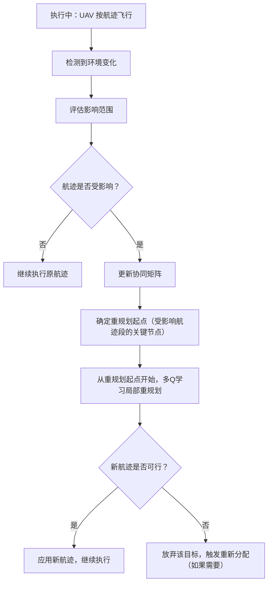

# 赵明博士论文分析：多无人机协同目标分配与航迹规划

> 论文：《多无人机系统的协同目标分配和航迹规划方法研究》
> 作者：赵明｜单位：哈尔滨工业大学｜年份：2016｜导师：苏小红
> 关键词：多无人机系统、多目标分配、协同航迹规划、三维空间、差分进化

---

## 一、论文要解决的核心问题

多无人机协同作战任务规划（MUCTAP）是一个**多模型、多约束**的组合优化问题。传统做法的困难在于：

- 不同任务类型（单对单、多对单、群巡游）有不同的数学模型，需要分别求解
- 三维地形环境下航程估算复杂
- 约束条件多（航程、载荷、协同、禁飞区等）
- 动态环境变化（新威胁、目标变化）需要在线重规划

赵明的核心贡献：**用统一的建模方法覆盖多种任务类型，用一致的算法求解。**

---

## 二、论文整体结构

```
第1章 绪论
  - 问题背景、研究现状、论文结构

第2章 复杂多约束多机协同目标分配统一建模
  - 三种任务模型的统一建模
  - 航程代价矩阵构建
  - 统一基因编码策略

第3章 基于改进离散差分进化的目标分配求解
  - 离散映射差分进化算法
  - 代价矩阵映射差分规则
  - 协同约束处理

第4章 三维多机多目标协同航迹规划
  - 基于文化算法的三维航迹规划
  - 空间模糊集表示
  - 协同航迹平滑算法

第5章 动态环境下的在线重规划
  - 基于多Q学习的航迹重规划
  - 动态模糊协同矩阵
  - 环境变化的适应机制

第6章 总结与展望
```

---

## 三、任务分配部分（第2-3章）

### 3.1 统一建模方法

**核心思想：** 不管是哪种任务类型，都用统一的代价矩阵和统一的编码来表示。

**三种任务模型：**

| 模型 | UAV vs 目标 | 特点 |
|------|------------|------|
| 单对单 | 1:1 | 每架 UAV 分配一个目标，无排序问题 |
| 多对单 | N:1 | 多架 UAV 协同打击同一目标，需协调到达 |
| 群巡游 | N:M (N<M) | 每架 UAV 访问多个目标，需决定访问顺序 |

**统一的关键：** 群巡游任务的代价矩阵构建方法——保证与其他模型具有统一的代价矩阵形式，从而确保能用一致的算法求解。

### 3.2 航程代价矩阵

不是简单的欧氏距离，而是考虑三维地形的实际可飞航程：

```
航程代价矩阵 (N × M)
  行：N 架 UAV
  列：M 个目标
  元素：UAV_i 到 Target_j 的估计航程代价

构建方法：
  - 利用空间垂直切面估算 UAV→目标 的实际航程
  - 考虑三维地形（山体、建筑等）的绕飞代价
  - 考虑禁飞区、雷达威胁区的规避代价
```

### 3.3 统一基因编码策略

**编码设计：** 用一种基因编码覆盖所有三种模型。

```
基因编码示例（3 架 UAV，5 个目标）：

单对单：[2, 4, 1] → UAV1→T2, UAV2→T4, UAV3→T1

群巡游：[2,5 | 4,1,3 | -]
  → UAV1: T2→T5（含访问顺序）
  → UAV2: T4→T1→T3（含访问顺序）
  → UAV3: 无任务
```

编码的关键：**统一的编码长度和含义**，不管哪种模型都用同一种编码方式。

### 3.4 离散映射差分进化算法

标准 DE 是连续优化算法，不能直接用于离散组合问题。赵明的改进：

```
标准 DE 操作（连续）：
  变异：v = x_r1 + F * (x_r2 - x_r3)
  交叉：u = crossover(x, v)
  选择：select better of (x, u)

离散映射 DE（赵明改进）：
  变异：通过代价矩阵映射，将连续差分操作转换为离散选择
  交叉：保持基因编码的可行性
  选择：基于目标函数值的贪婪选择
```

**代价矩阵映射差分规则：** 利用航程代价矩阵的结构特性，将连续空间的差分操作映射到离散空间，使 DE 能直接在组合空间中搜索。

### 3.5 协同约束处理

多 UAV 打同一目标时的约束：
- 到达时间协调
- 攻击角度约束
- 毁伤概率评估

这些约束被融入目标函数中。

---

## 四、航迹规划部分（第4章）

### 4.1 三维航迹规划

目标分配完成后，需要为每架 UAV 规划实际可飞航迹。

**方法：** 基于文化算法（Cultural Algorithm）+ 空间模糊集

- 文化算法：一种模拟文化进化过程的优化算法，包含信念空间和种群空间
- 空间模糊集：用于三维空间的模糊表示，降低搜索空间复杂度
- 协同航迹平滑：确保多机航迹不冲突、满足飞行力学约束

### 4.2 分配与航迹的耦合

论文的一个重要观点：**目标分配和航迹规划是耦合的**。

- 分配依赖航迹代价（分配时需要知道飞过去要多少代价）
- 航迹依赖分配结果（分配完才知道要飞去哪）

赵明的处理方式：**统一模型**——在分配阶段就使用估计的航程代价（而非欧氏距离），减少分配与航迹之间的不一致性。

---

## 五、在线重规划部分（第5章）

### 5.1 重规划的性质：路径重规划，不是分配重规划

赵明的重规划**主要是航迹（路径）层面的调整，不是任务分配层面的重分配。**

```
初始分配（第2-3章）：UAV1→T2→T5, UAV2→T1→T3→T4  ← 分配方案定了
初始航迹（第4章）：为每架 UAV 规划具体飞行航迹    ← 路径定了

执行中环境变化：新威胁出现、禁飞区扩大、目标移动
                    ↓
重规划（第5章）：调整飞行航迹，绕飞/改道          ← 只改路径
                （目标分配不变，还是去那些目标）
```

只有在极端情况下（航迹完全被堵死、目标不可达），才可能触发目标的放弃或重新分配。论文的重点是路径层面的重规划。

### 5.2 动态环境问题

实际执行中环境会变化：
- 新威胁出现（新禁飞区、新雷达）
- 目标状态变化（目标移动、消失）
- UAV 故障（某架 UAV 失联）

这些变化要求**在线重规划**——不完全重算，而是在已有方案基础上调整航迹。

### 5.3 基于多Q学习的重规划方法

**方法：** 将重规划建模为强化学习问题。

```
状态（State）：
  - 当前航迹状态（UAV 当前位置、已飞过的航迹段）
  - 环境变化信息（新威胁位置、禁飞区变化）
  - 协同状态（其他 UAV 的位置和航迹）

动作（Action）：
  - 绕飞：保持目标不变，绕开新威胁
  - 改道：选择新的航迹段到达目标
  - 放弃目标：目标不可达时，放弃该目标

回报（Reward）：
  - 动态模糊协同矩阵：反映多机协同的代价变化
  - 航程代价：调整后的路径长度
  - 安全代价：新航迹的风险评估
```

### 5.4 关键机制详解

#### 动态模糊协同矩阵

协同矩阵是一个 N×N 矩阵，记录 UAV 之间的协同关系和约束：

```
协同矩阵 C[i][j] = UAV_i 与 UAV_j 之间的协同代价

环境变化时更新协同矩阵：
  - 新威胁出现 → 受影响的 UAV 对的协同代价增大
  - 目标移动 → 相关 UAV 的协同代价重新计算
  - UAV 故障 → 该 UAV 相关的行/列标记为不可用
```

协同矩阵的作用：**让每架 UAV 的重规划决策考虑其他 UAV 的状态**，避免各机独立重规划导致冲突。

#### 多Q学习机制

```
每架 UAV 有独立的 Q 学习器：
  Q_uav1: 状态 → 动作 的价值函数
  Q_uav2: 状态 → 动作 的价值函数
  ...

协调方式：
  - 各 UAV 的 Q 学习器独立更新
  - 但通过协同矩阵共享信息
  - UAV_i 选择动作时，参考协同矩阵中与其他 UAV 的代价
  - 实现"独立决策，协同感知"
```

这是一种**分布式协同**的思路——每架 UAV 自主决策，但通过协同矩阵保持全局协调。

#### 局部重规划

```
不是从头重算整条航迹，而是：

原航迹：起点 ──→ A ──→ B ──→ C ──→ 终点
                          ↑
                     环境变化点（新威胁）

局部重规划：
  - 以 B（已知航迹的关键节点）为起点
  - 从 B 到终点重新规划一段航迹
  - 起点到 B 的航迹保持不变
  - 大幅减少计算量
```

### 5.5 重规划的完整流程



### 5.6 重规划的特点

| 特点 | 说明 |
|------|------|
| **路径层面** | 主要调整飞行航迹，不改变任务分配 |
| **增量式** | 不是完全重算，而是在已有方案基础上调整 |
| **局部性** | 只重规划受影响的航迹段，从关键节点开始 |
| **协同性** | 通过协同矩阵保持多机协调，避免冲突 |
| **适应性** | 能适应环境的动态变化（新威胁、目标变化） |
| **分布式** | 每架 UAV 独立 Q 学习器，通过协同矩阵协调 |

---

## 六、方法的优势与局限

### 优势

| 优势 | 说明 |
|------|------|
| **统一框架** | 一套方法覆盖单对单、多对单、群巡游三种模型 |
| **三维环境** | 航程代价考虑了实际地形，不是平面近似 |
| **约束融合** | 航程、禁飞区、威胁区等约束自然融入代价矩阵 |
| **分配+航迹耦合** | 减少了分配与航迹之间的不一致性 |
| **在线重规划** | 支持动态环境下的增量调整 |

### 局限

| 局限 | 说明 |
|------|------|
| **返回策略未显式处理** | 模型的终点是目标点，未考虑"返回基地"或"就近机巢" |
| **时间窗未显式处理** | 未考虑任务时间窗约束（必须在某时间范围内到达） |
| **损毁代价未考虑** | 目标函数中没有 UAV 损毁风险的评估 |
| **单目标优化** | 原始 DE 是单目标，未原生支持多目标权衡（距离 vs 风险 vs 时间） |
| **异构能力建模简化** | UAV 能力差异通过代价矩阵体现，但 UAV 类型匹配约束处理较简单 |

---

## 七、对我们项目的适用性分析

### 直接适用

| 我们的场景 | 匹配程度 | 说明 |
|-----------|---------|------|
| 一对一指派 | ✅ 完全适用 | 单对单模型直接覆盖 |
| 多机协同（多对一） | ✅ 完全适用 | 多对单模型直接覆盖 |
| 一机多目标 + 排序 | ✅ 完全适用 | 群巡游模型覆盖 |
| 三维地形环境 | ✅ 原生支持 | 航程代价考虑了地形 |
| 异构 UAV | ✅ 原生支持 | 代价矩阵体现 UAV 差异 |
| 航程/续航约束 | ✅ 原生支持 | 航程代价矩阵天然包含 |

### 需要扩展

| 扩展方向 | 现状 | 我们的需求 | 扩展方式 |
|---------|------|-----------|---------|
| **返回策略** | 终点是目标点 | 返回起点 / 就近机巢 | 在编码中加入终点决策，代价矩阵增加"目标→基地/机巢"段 |
| **时间窗约束** | 未处理 | 任务有时间窗 | 目标函数中加入时间窗违反惩罚 |
| **多目标权衡** | 单目标 DE | 距离/风险/时间/成本多目标 | 改为多目标差分进化（MODE）或加权求和 |
| **风险评估融入** | 仅考虑航程代价 | 法规/气象/障碍物/通信风险 | 将风险评分加入代价矩阵，与航程代价融合 |
| **损毁/安全代价** | 未考虑 | UAV 飞行安全 | 目标函数中加入风险惩罚项 |
| **重规划触发** | Q学习自动适应 | Agent 感知事件触发 | 将 Q学习重规划与 Agent 的事件感知对接 |
| **优先级约束** | 未显式处理 | 任务有优先级 | 目标函数中加入优先级权重 |

### 扩展难度评估

| 扩展方向 | 难度 | 说明 |
|---------|------|------|
| 返回策略 | 低 | 在编码和代价矩阵上加一段"回程"，不改变核心算法 |
| 时间窗约束 | 中 | 需要在解码和评估阶段加时间检查 |
| 多目标权衡 | 中 | MODE 是成熟方法，或用加权求和简化 |
| 风险融入 | 低 | 风险评分作为代价矩阵的一个维度即可 |
| 重规划对接 | 中 | 需要设计 Agent 触发重规划的接口 |

---

## 八、参考文献

1. 赵明, 苏小红, 马培军, 赵玲玲. 复杂多约束UAVs协同目标分配的一种统一建模方法. 自动化学报, 2012, 38(12): 2038-2048.
2. Zhao M, Zhao L, Su X, et al. Improved discrete mapping differential evolution for multi-UAVs cooperative multi-targets assignment under unified model. International Journal of Machine Learning & Cybernetics, 2017.
3. Zhao M, Zhao L, Su X, et al. A cultural algorithm with spatial fuzzy set to solve Multi-UAVs cooperative path planning in a three dimensional environment. Journal of Harbin Institute of Technology, 2015.
4. Su X, Zhao M, Zhao L, et al. A Novel Multi Stage Cooperative Path Re-planning Method for Multi UAV. 2016.
5. Zhao M, et al. A Cooperative Path Planning and Smoothing Algorithm for UAVs in Three Dimensional Environment. 2014.
