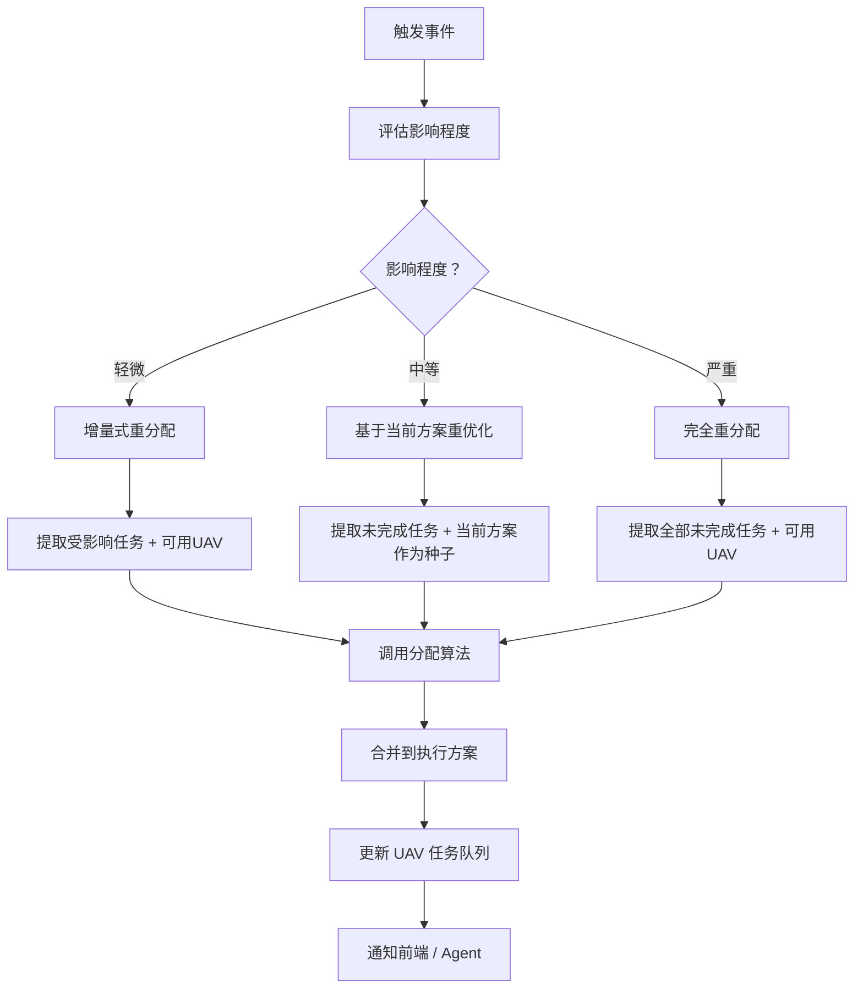

# 重规划设计（讨论稿）

## 一、重规划的两层结构

重规划分为两层，优先级从高到低：

```
环境变化
  ↓
┌─────────────────────────────┐
│  第一层：航迹重规划（路径层面） │  ← 优先尝试
│  调整飞行路径，分配方案不变     │
└──────────┬──────────────────┘
           │ 解决不了
           ↓
┌─────────────────────────────┐
│  第二层：分配重规划（任务层面） │  ← 最后手段
│  重新分配任务，可能改变谁去哪   │
└─────────────────────────────┘
```

**原则：能用路径重规划解决的，不动分配。分配重规划是最后手段。**

---

## 二、航迹重规划

### 2.1 什么时候触发

| 触发条件 | 示例 |
|---------|------|
| 航迹上出现新障碍 | 新建禁飞区、新雷达威胁 |
| 地形变化 | 临时建筑、道路封闭 |
| 气象变化 | 突发雷暴区域 |
| 通信盲区 | 某航路段信号丢失，需要绕行 |

### 2.2 核心思路

赵明论文的方法：**局部重规划**——不是重算整条航迹，只调整受影响的航迹段。

```
原航迹：起点 ──→ A ──→ B ──→ C ──→ 目标
                          ↑
                     新威胁出现

重规划：B → C → 目标 这段重新规划
        起点 → A → B 这段保持不变
```

### 2.3 我们的方案：基于 A* 的航迹重规划

赵明用 Q 学习做航迹重规划，我们用 A* 家族的算法替换：

| 方案 | 说明 | 适用场景 |
|------|------|---------|
| **重跑 A*** | 从当前位置到目标重新跑一次 A* | 简单直接，任何场景 |
| **D* Lite** | A* 的增量式版本，环境变化时只更新受影响节点 | 频繁小变化，实时性要求高 |
| **局部 A*** | 只在受影响的航迹段附近跑 A*，与原航迹拼接 | 变化范围小 |

**推荐：初期用重跑 A*，后期优化为 D* Lite。**

理由：
- 重跑 A* 实现最简单，<50 架规模下计算量可接受
- D* Lite 实现复杂度高，但更适合频繁变化的动态环境
- 两者对外接口一致，切换不影响上层逻辑

### 2.4 航迹重规划流程

```
检测到环境变化
  ↓
评估影响范围：哪些航迹段受影响？
  ↓
┌─ 无航迹受影响 → 继续执行原航迹
│
├─ 部分航迹受影响 → 对每架受影响的 UAV：
│   ├─ 确定重规划起点（当前飞行位置或下一个关键节点）
│   ├─ 从重规划起点到目标重跑 A*
│   ├─ 可行 → 应用新航迹
│   └─ 不可行 → 标记该 UAV 目标不可达，上报触发分配重规划
│
└─ 大面积受影响 → 直接触发分配重规划
```

### 2.5 多机避碰

航迹重规划时需要考虑多机避碰——重规划后的航迹不能与其他 UAV 的航迹冲突。

| 策略 | 说明 |
|------|------|
| 时间窗避碰 | 在 A* 搜索时加入时间维度，避免同一时间到达同一空间 |
| 优先级避碰 | 高优先级 UAV 先规划，低优先级 UAV 避让 |
| 协同矩阵 | 参考赵明的方法，通过协同矩阵感知其他 UAV 的航迹 |

**初期可以用优先级避碰**——简单有效。后期再考虑时间窗或协同矩阵。

---

## 三、分配重规划

### 3.1 什么时候触发

| 触发条件 | 示例 | 优先级 |
|---------|------|--------|
| UAV 故障/失联 | 该 UAV 的任务无人执行 | 高 |
| UAV 能力下降 | 电量不足、载荷损坏，原分配不可行 | 高 |
| 路径完全堵死 | 航迹重规划解决不了 | 高 |
| 新任务插入 | 紧急任务需要分配 | 中 |
| 任务取消 | 目标消失，原分配浪费资源 | 低 |
| 大面积环境变化 | 多条航迹不可行，需整体重分配 | 高 |

### 3.2 决策逻辑

```
触发事件
  ↓
评估影响程度
  │
  ├── 轻微（1 架 UAV 受影响、1 个任务变更）
  │   → 增量式重分配
  │
  ├── 中等（多架 UAV 受影响、多任务变更）
  │   → 基于当前方案的重优化
  │
  └── 严重（大面积不可行）
      → 完全重分配
```

### 3.3 方法一：增量式重分配

**思路：** 只重分配受影响的任务，其他 UAV 的分配方案不变。

```
当前方案：
  UAV1: [T2, T5]（T2 正在执行）
  UAV2: [T1, T3, T4]（T1 正在执行）
  UAV3: [T6, T7] → 故障

受影响任务：T6, T7（UAV3 的未完成任务）
可用 UAV：UAV1（剩余容量）、UAV2（剩余容量）

→ 对 T6, T7 分配给 UAV1 或 UAV2
→ UAV1、UAV2 的原有分配不变
```

**适用：** 单架 UAV 故障、个别新任务插入等局部变化。

**实现：**
1. 识别受影响任务集合
2. 识别可用 UAV 集合（排除正在执行任务的 UAV）
3. 对受影响任务重新跑分配算法（匈牙利或 DE）
4. 合并到原有方案中

### 3.4 方法二：基于当前方案的重优化

**思路：** 用当前方案作为初始解，在此基础上用 DE/GA 优化。

```
初始种群：
  个体 1：当前方案（未完成部分）
  个体 2-5：当前方案的邻域解（微调分配）
  个体 6-N：随机解

→ 进化迭代 → 输出新的最优分配
```

**适用：** 多架 UAV 变化、多任务变更，需要全局视角。

**实现：**
1. 提取当前方案中的未完成部分
2. 作为 DE 种群的初始个体之一
3. 调用原有的分配算法（离散 DE）
4. 输出新方案

### 3.5 方法三：完全重分配

**思路：** 忽略原有方案，对所有未完成任务和可用 UAV 重新跑分配。

```
未完成任务：T1, T2, T3, T4, T6, T7
可用 UAV：UAV1, UAV2

→ 对全部未完成任务重新跑分配算法
```

**适用：** 大面积变化、原有方案已无参考价值。

**实现：** 直接调用初始分配接口，输入当前状态。

### 3.6 重分配的约束

| 约束 | 说明 |
|------|------|
| 正在执行的任务不中断 | UAV 正在飞向某个目标，不要中途改派 |
| 已完成的任务不重分配 | 已经做完的任务从任务池中移除 |
| UAV 当前位置更新 | 重分配时 UAV 的起始位置是当前位置，不是初始基地 |
| 剩余续航更新 | 重分配时用 UAV 的剩余续航，不是满电续航 |

### 3.7 重分配流程



---

## 四、两层重规划的协调

### 4.1 触发优先级

```
事件发生
  ↓
先尝试航迹重规划
  ├─ 成功 → 继续执行，不触发分配重规划
  └─ 失败（目标不可达）→ 触发分配重规划
```

### 4.2 Agent 的角色

Agent 是重规划的"大脑"——感知事件、判断严重程度、决定触发哪层重规划：

```
Agent 接收事件
  ↓
评估事件类型和严重程度
  ├─ "新禁飞区出现在 UAV1 航路上" → 触发航迹重规划
  ├─ "UAV3 故障" → 触发分配重规划（增量式）
  └─ "大面积雷暴覆盖整个任务区" → 触发分配重规划（完全重分配）
  ↓
调用 Python 后端对应的 API
```

### 4.3 API 设计

| 方法 | 路径 | 说明 |
|------|------|------|
| POST | `/api/v1/paths/replan` | 航迹重规划（单 UAV，局部路径调整） |
| POST | `/api/v1/tasks/reschedule` | 分配重规划（可能影响多 UAV） |
| POST | `/api/v1/tasks/reschedule/validate` | 重分配预检查（不执行） |

---

## 五、待定问题

### 1. 航迹重规划算法选型

- 初期用重跑 A* 还是直接上 D* Lite？
- 多机避碰用优先级策略还是时间窗？

### 2. 增量式重分配的"增量"粒度

- "轻微/中等/严重"的阈值怎么定？
- 1 架 UAV 故障 = 轻微？2 架 = 中等？按比例还是按绝对数？

### 3. 正在执行的任务如何处理

- UAV 正在飞向 T2，此时 T2 被取消 → UAV 原路返回？飞往下一个任务？就近降落？
- UAV 正在飞向 T2，此时 UAV3 故障，T6 需要重分配 → UAV1 能否中途改道去 T6？

### 4. 重规划的通信保障

- 重规划需要实时通信，如果通信中断怎么办？
- 是否需要 UAV 端有本地自主决策能力？

### 5. 重规划的频率限制

- 短时间内多次触发重规划怎么办？是否需要防抖机制？
- 重规划结果不稳定（频繁切换方案）怎么处理？
