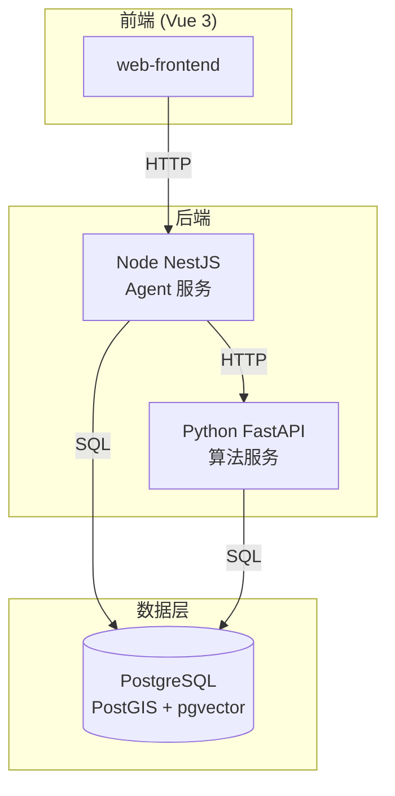

# 架构文档

## 系统架构



## 分层架构

每个后端服务内部采用分层架构：

```
表现层 (routes/controllers)
    ↓
业务层 (services)
    ↓
算法层 (algorithms)  ← Python 端
    ↓
数据访问层 (repositories)
    ↓
数据库 (db/models)
```

## 技术选型

| 决策 | 选择 | 原因 |
|------|------|------|
| [前端框架](decisions/前端技术选型建议.md) | Vue 3 | 生态成熟、学习曲线适中 |
| [后端框架](decisions/后端技术选型建议.md) | NestJS + FastAPI | TypeScript 生态 + Python 算法生态 |
| 数据库 | PostgreSQL | PostGIS 空间查询 + pgvector 向量搜索 |
| ORM | Drizzle + SQLAlchemy | 类型安全、异步支持 |
| 共享类型 | @st-risk/shared-ts | 前后端类型一致，减少联调成本 |
