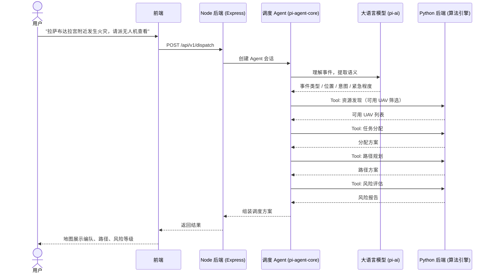
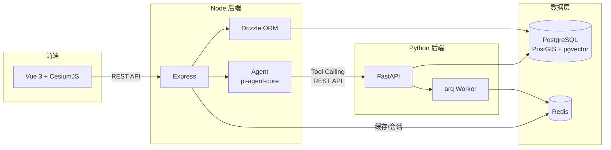

# 后端技术选型建议

## 技术栈总览

```
┌─────────────────────────────────────────────────────────┐
│                      前端 (已有文档)                      │
│         Vue 3 + Shadcn-vue + CesiumJS + ECharts         │
└────────────────────────┬────────────────────────────────┘
                         │ REST API
┌────────────────────────┴────────────────────────────────┐
│                   Node 后端 (BFF + Agent)                 │
│                                                          │
│  Web 框架：Express                                       │
│  ORM：Drizzle                                            │
│  Agent 底座：pi-ai + pi-agent-core                       │
│  Agent 业务层：自定义 Agent + 自定义 Tool（调 Python API） │
│  缓存/队列：Redis                                        │
└────────────────────────┬────────────────────────────────┘
                         │ REST API
┌────────────────────────┴────────────────────────────────┐
│                  Python 后端 (算法引擎)                    │
│                                                          │
│  框架：FastAPI（已选定）                                   │
│  任务队列：arq + Redis                                    │
│  ORM：SQLAlchemy 2.0 (async) + GeoAlchemy2               │
│  空间数据：GeoPandas + Shapely                            │
│  向量检索：pgvector (Python)                              │
│  科学计算：NumPy + SciPy + NetworkX                       │
└────────────────────────┬────────────────────────────────┘
                         │
┌────────────────────────┴────────────────────────────────┐
│                     数据层                               │
│  PostgreSQL 16+ · PostGIS 3.4+ · pgvector 0.7+ · Redis 7│
└─────────────────────────────────────────────────────────┘
```

---

## 一、Node 后端

### 1. Web 框架：Express

| 维度 | 说明 |
|------|------|
| 定位 | 成熟稳定的 Web 框架，生态最全 |
| 性能 | ~3k QPS，对 BFF 场景足够（瓶颈在 Python 算法计算，不在 Node 转发） |
| TypeScript | `@types/express` 社区方案，类型体验略逊于 Fastify，但够用 |
| 中间件生态 | 最全——鉴权、限流、日志、CORS 等均有成熟方案 |
| 学习成本 | 极低，团队大概率已有经验 |

**选型理由：** 项目瓶颈在算法计算层，不在 BFF 层。Express 生态成熟、团队熟悉、中间件齐全，作为 Agent 和业务逻辑的载体完全够用。

### 2. ORM：Drizzle

| 维度 | 说明 |
|------|------|
| 定义方式 | 代码优先（TypeScript 文件），无需 DSL |
| 性能 | 接近原生 SQL，零运行时开销 |
| PostGIS 支持 | 可直接写原生 SQL，不被 ORM 抽象层卡住 |
| pgvector 支持 | 原生支持向量操作 |
| 迁移 | 轻量 SQL 文件，无二进制依赖 |
| 部署 | 无 Prisma Engine 二进制依赖，容器化友好 |

**选型理由：** 数据库会重度使用 PostGIS 空间查询和 pgvector 向量检索，Drizzle 允许直接写原生 SQL，不被抽象层限制。性能和部署也比 Prisma 更友好。

### 3. Agent 底座：pi-ai + pi-agent-core

采用 [Pi Agent](https://github.com/earendil-works/pi) 的核心层作为 Agent 运行时底座，业务层自行开发。

#### Pi 架构分层

```
pi（5 包 monorepo）
├── pi-ai              → 统一 LLM API 层（15+ 模型提供商）
├── pi-agent-core      → Agent 运行时（事件驱动、Tool Calling、会话管理）
├── pi-coding-agent    → 编码 Agent 实现（不用，我们自己写业务 Agent）
├── pi-tui             → 终端 UI（不用）
└── pi-web-ui          → Web UI（不用）
```

#### 我们使用的部分

| 包 | 用途 | 定制程度 |
|----|------|---------|
| **pi-ai** | 统一 LLM API，对接多模型提供商 | 直接用，不改 |
| **pi-agent-core** | Agent Loop、事件驱动、Tool Calling 运行时 | 直接用，不改 |
| 自定义 Agent | 无人机调度 Agent 定义（系统提示、Tool 注册、上下文管理） | 自己写 |
| 自定义 Tool | 调用 Python 算法 API（任务分配、路径规划、风险评估、资源发现） | 自己写 |
| 自定义编排 | 事件理解 → 资源发现 → 任务分配 → 路径规划 → 风险评估 | 自己写 |

#### 为什么选 Pi 而不是 LangChain / Mastra

| 维度 | Pi | LangChain.js | Mastra |
|------|-----|-------------|--------|
| 架构体量 | **极简 5 包** | 庞大，模块多 | 中等 |
| 底层程度 | **够底层，可塑性强** | 抽象层多，难改 | 中等 |
| LLM 统一层 | ✅ pi-ai（15+ 提供商） | ✅ | ✅ |
| Agent Loop | ✅ 事件驱动 + Steering | ✅ | ✅ |
| coding agent 皮 | 有，但可以不用 | 无 | 无 |
| 代码风格 | TS 原生，干净 | Python 转译痕迹 | TS 原生 |
| 适合改造 | ⭐⭐⭐⭐⭐ | ⭐⭐ | ⭐⭐⭐ |

**核心理由：** Pi 足够简洁、足够底层，趋同于轻量自建。用它的核心层相当于"站在一个经过验证的 Agent 运行时之上写自己的业务"，比从零写 Agent Loop 省力，比用重型框架自由。

#### Agent 工作流设计



#### 自定义 Tool 示例（概念）

```typescript
// tools/resource-discovery.ts
// 调用 Python 后端的资源发现 API
const resourceDiscoveryTool = defineTool({
  name: "resource_discovery",
  description: "根据任务需求筛选可用的异构无人机资源",
  parameters: z.object({
    location: z.object({ lat: z.number(), lng: z.number() }),
    taskType: z.enum(["reconnaissance", "delivery", "patrol", "enforcement"]),
    payloadWeight: z.number().optional(),
    urgency: z.enum(["low", "medium", "high", "urgent"]),
  }),
  execute: async (params) => {
    // 调用 Python 后端 REST API
    const res = await fetch("http://python-api:8000/api/v1/resources/discover", {
      method: "POST",
      body: JSON.stringify(params),
    });
    return res.json();
  },
});

// tools/task-allocation.ts
// tools/path-planning.ts
// tools/risk-assessment.ts
// ... 同理，每个 Tool 封装一个 Python API 调用
```

---

## 二、Python 后端（算法引擎）

### 1. Web 框架：FastAPI ✅ 已选定

异步原生、自动 OpenAPI 文档、Pydantic 校验——算法 REST API 的最佳选择，无需更改。

### 2. 长时任务队列：arq + Redis

| 维度 | Celery | arq | FastAPI BackgroundTasks |
|------|--------|-----|------------------------|
| 异步原生 | ⭐⭐ 需桥接 | ⭐⭐⭐⭐⭐ 原生 async | ⭐⭐⭐⭐ 原生 async |
| 消息中间件 | Redis / RabbitMQ | Redis | 无（进程内） |
| 重试/监控 | 完善 | 基础 | 无 |
| 适合场景 | 大规模分布式 | **中小型异步任务** | 极轻量收尾 |
| 与 FastAPI 契合 | 需桥接 | **天然契合** | 天然契合 |

**选型理由：** 算法引擎不需要 Celery 的分布式集群能力。arq 轻量、原生 async、与 FastAPI 天然配合。多机路径规划、大规模风险评估等耗时任务通过 arq 异步执行，短任务直接同步返回。

### 3. 数据库 / 空间数据

| 库 | 用途 |
|----|------|
| **SQLAlchemy 2.0** (async) | ORM，异步支持 |
| **GeoAlchemy2** | PostGIS 空间查询集成（ST_DWithin、ST_Intersects 等） |
| **asyncpg** | 高性能异步 PostgreSQL 驱动 |
| **pgvector (Python)** | pgvector 向量检索，配合 SQLAlchemy 使用 |
| **GeoPandas** | 空间数据处理、分析（DataFrame 式操作） |

### 4. 科学计算 / 算法基础

| 库 | 用途 |
|----|------|
| **NumPy** | 数值计算基础 |
| **SciPy** | 优化算法（线性规划、指派问题等） |
| **NetworkX** | 图算法（路径规划、网络分析） |
| **Shapely** | 几何计算（距离、缓冲区、碰撞检测） |

---

## 三、数据层

| 组件 | 版本 | 用途 |
|------|------|------|
| **PostgreSQL** | 16+ | 主数据库：事务、JSON、全文检索 |
| **PostGIS** | 3.4+ | 空间扩展：UAV 位置索引、禁飞区、地理围栏、空间距离查询 |
| **pgvector** | 0.7+ | 向量扩展：任务语义匹配、场景相似度检索 |
| **Redis** | 7+ | 缓存 + 消息：会话缓存、arq 任务队列、Agent 短期记忆 |

---

## 四、服务间通信



| 路径 | 协议 | 说明 |
|------|------|------|
| 前端 → Node | REST API | 统一入口，鉴权、会话管理 |
| Node Agent → Python | REST API | Agent 通过 Tool Calling 调用算法接口 |
| Node / Python → PostgreSQL | TCP | Drizzle (Node) + SQLAlchemy (Python) |
| Python → Redis | TCP | arq 任务队列 |
| Node → Redis | TCP | 会话缓存、Agent 短期记忆 |
